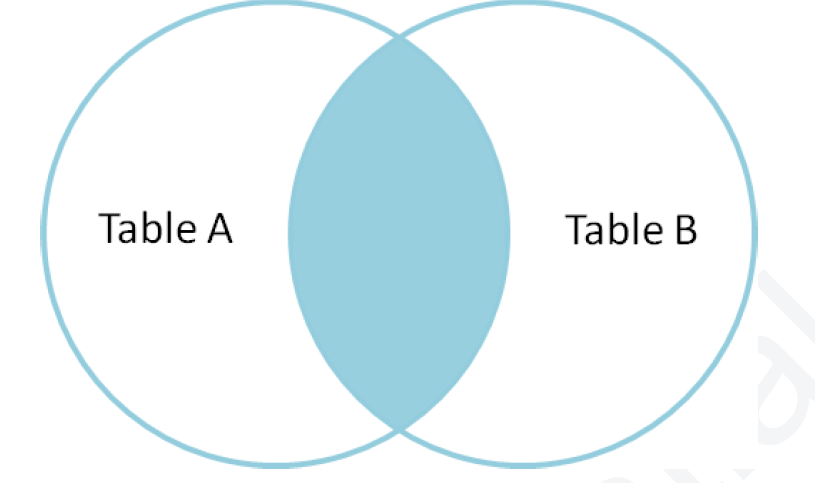

INNER JOIN only returns rows when there is a common value that exists between two tables.
INNER JOINS are used when data is required from two or more tables and there’s a common
value between these tables and exclude unmatching records.

**INNER JOIN Syntax**:

```sql
SELECT table_1.column1, table_2.column_1 FROM table 1 INNER JOIN table 2 ON
table_1.column_2 = table_2.column_2;
```


Let’s consider this example in the following table:

Table **Employees**

|  employee_id | employee_name | department_id |
|----------|----------|------|
| 1 | Tony | 100| 
| 2| Silvio | 101| 
| 3 | Paulie | 102 | 
| 4 | Bobby | 103 | 

Table **Departments**

|  department_id | department_name | 
|----------|----------|
| 100 | Boss | 
| 101| Consigliere | 
| 102| Under Boss | 

In this example, we have two tables of a Waste Management company such as Employees and Department with a common column between the two tables(department_id).

In such scenarios, we can execute an SQL Inner join to retrieve data from both tables as:

```sql
SELECT e.employee_name, d.department_name FROM employees e INNER JOIN
departments d ON e.department_id = d.department_id;
```
|  Value | Description | 
|----------|----------|
| e | An alias *(substitute name)* for the employees table. | 
| d| An alias *(substitute name)* for the departments table.  | 
| employee_name| Column from employee table that needs to be retrieved. | 
| department_name| Column from department table that needs to be retrieved. | 
| employees e| Employee table indicated with an alias e. | 
| department d|Department table indicated with an alias d | 
| INNER JOIN| Specified the type of join being performed. | 
| ON e.department_id = d.department_id| A condition that indicates join is taking place between department_id column of employees(e) and department(d) tables. |

**Output**:

|  employee_name | department_name | 
|----------|----------|
| Tony | Boss | 
| Silvio| Consigliere | 
| Paulie| Under Boss | 